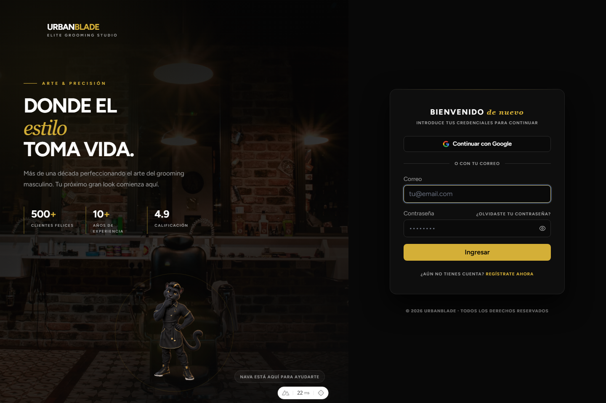
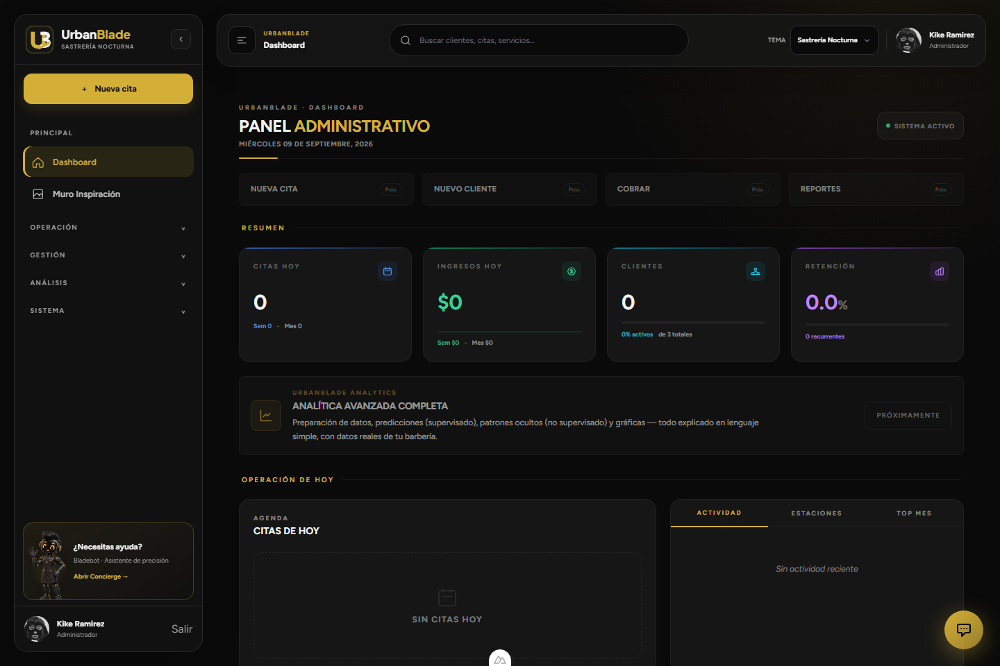

# Demo de demostración — UrbanBlade

## Objetivo

Presentar UrbanBlade en 5 a 10 minutos mostrando la plataforma como sistema real de operación para barberías, con varios roles, datos sembrados y una experiencia funcional completa para administración, atención y cliente.

## Vista previa de la demo

<div align="center">






</div>

## Preparación rápida

Si el proyecto no está levantado:

```powershell
docker compose up -d --build
npm install
npm run build
docker compose exec app php artisan key:generate
docker compose exec app php artisan storage:link
docker compose exec app php artisan migrate
docker compose exec app php artisan db:seed --class=RolePermissionSeeder
docker compose exec app php artisan db:seed --class=AdminUserSeeder
```

> ⚠️ No uses `migrate --seed` — siembra `BarberSeeder`/`ClientSeeder`
> completos (50 barberos y 1500 clientes falsos) y volvería a llenar la base
> de datos sintéticos masivos. Ver [ACCESOS.md](ACCESOS.md) para las notas
> completas.

Luego abre:

- http://localhost:8000/login
- Mailpit: http://localhost:8025

## Credenciales

Las credenciales reales (una cuenta por rol) viven en un único lugar para no
desincronizarse: **[ACCESOS.md](ACCESOS.md)**.

---

## Guion de presentación (5 minutos)

### 1. Login como administrador (45 s)

- Entra con la cuenta de administrador.
- Muestra el dashboard principal con KPIs y métricas.
- Destaca la visión general del negocio, ventas, clientes, productividad y reportes.

### 2. Mostrar operación real (1 min)

- Navega a citas, clientes y pagos.
- Explica que el sistema centraliza atención y cobro.
- Destaca la gestión de servicios y seguimiento operativo.

### 3. Mostrar analítica (1 min)

- Abre la vista /analitica.
- Muestra que hay insights accionables para decisiones del negocio.
- Explica que esta parte complementa la operación con orientación estratégica.

### 4. Cambiar a recepcionista (45 s)

- Cierra sesión y entra con recepcionista.
- Muestra la agenda del turno y la atención rápida al cliente.
- Enfatiza la parte operativa del negocio.

### 5. Cambiar a barbero (45 s)

- Entra como barbero.
- Muestra Mi Agenda, perfil y estados de cita.
- Destaca la gestión personal del barbero y su flujo diario.

### 6. Cambiar a cliente (1 min)

- Inicia sesión como cliente.
- Muestra historial de citas, tienda, carrito y membresía.
- Explica que la experiencia del cliente es parte central del producto.

---

## Qué resaltar en la demo

### Administrador

- Dashboard global.
- Reportes y control operativo.
- Pagos, clientes, servicios y analítica.

### Recepción

- Atención rápida.
- Agenda del día.
- Cobro y gestión de pedidos.

### Barbero

- Agenda personal.
- Aceptar o rechazar citas.
- Portafolio y perfil profesional.

### Cliente

- Reservas.
- Historial y pagos.
- Compras y membresía.

---

## Mensaje de cierre

> UrbanBlade no es solo un sistema de citas; es una plataforma completa de operación para barberías con enfoque administrativo, servicio al cliente y decisiones basadas en datos.

---

## Recomendación final

Para una demo limpia conviene comenzar como administrador y luego cambiar de rol para mostrar el mismo negocio desde distintas perspectivas. Eso comunica mejor el valor real del producto en menos tiempo.

## Documentación relacionada

- [README.md](../README.md)
- [ACCESOS.md](ACCESOS.md)
