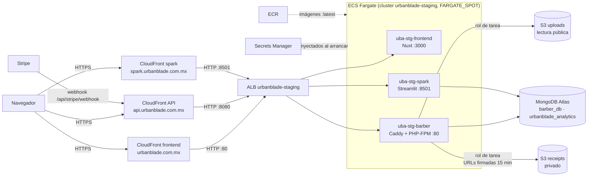

# Despliegue de staging en AWS

Entorno de **pruebas** (no producción) que corre los tres proyectos activos —`barber`
(API), `frontend-urban` (Nuxt) y `spark` (dashboard)— en AWS. Sustituye al plan de
Oracle Cloud de [`ORACLE_CLOUD_PRUEBAS.md`](ORACLE_CLOUD_PRUEBAS.md), que nunca llegó a
desplegar la aplicación.

- Cuenta AWS `209479293733`, región `us-east-1`.
- Dominio propio desde el 23-sep-2026: **`urbanblade.com.mx`** (frontend), `api.urbanblade.com.mx`
  (API) y `spark.urbanblade.com.mx` (dashboard). Comprado en GoDaddy; el DNS lo atiende
  Route 53 y el HTTPS lo da un certificado de ACM en CloudFront. Detalle en la sección
  "El dominio `urbanblade.com.mx`". Las URL `*.cloudfront.net` siguen funcionando, pero ya
  no las usa ninguna app.
- Credenciales de acceso: no viven aquí. Las de la aplicación están en Secrets Manager
  (nombres abajo, nunca valores); las de las cuentas de prueba, en [`ACCESOS.md`](ACCESOS.md).
- **Este documento se verificó contra la cuenta real de AWS el 23 de septiembre de 2026**
  (`aws sts get-caller-identity`, `describe-services`, `list-distributions`,
  `list-secrets`, `describe-repositories`, `list-buckets`): todo lo escrito aquí
  coincide con lo que hay desplegado. `spark` está apagado (`desired-count 0`) para
  ahorrar costo; `barber` y `frontend` están encendidos. Si alguien vuelve a leer esto
  meses después y algo no cuadra con lo que ve en la consola de AWS, confía en lo que
  ve, no en esta fecha.

## Antes de empezar: qué es cada cosa

Sin experiencia previa en AWS, estos son los conceptos que aparecen todo el documento:

| Término | En una frase |
|---|---|
| **ECS / Fargate** | El servicio que mantiene los contenedores (`barber`, `frontend-urban`, `spark`) corriendo, sin que tengas que administrar un servidor tú mismo. |
| **Task definition** | La "receta" de un contenedor: qué imagen usa, cuánta CPU/memoria tiene, qué variables de entorno y secretos recibe. Cambiar variables/secretos = registrar una receta nueva. |
| **Servicio ECS** (`uba-stg-barber`, etc.) | Mantiene viva 1 (o más) copias de una task definition; si una se cae, la repone sola. |
| **ALB** (Application Load Balancer) | La puerta de entrada interna que reparte el tráfico HTTP hacia el contenedor correcto según el puerto. |
| **CloudFront** | La puerta de entrada pública con HTTPS; hay una distribución por app (frontend, API, spark), cada una con su propia URL `*.cloudfront.net`. |
| **Route 53** | El DNS del dominio: decide a qué servidor apunta cada nombre (`api.`, `spark.`, el dominio raíz…). |
| **ACM** | Emite y renueva solo el certificado HTTPS que CloudFront muestra en el dominio propio (gratis). |
| **ECR** | Donde se guardan las imágenes Docker que ECS despliega (como un Docker Hub privado de la cuenta). |
| **Secrets Manager** | Donde viven las claves/contraseñas reales (Stripe, MongoDB, Google) — nunca en este repo ni en la task definition en texto plano. |
| **S3** | Almacenamiento de archivos: uno público (imágenes de servicios/productos) y uno privado (comprobantes de pago, con URLs firmadas de 15 min). |

Antes de tocar cualquier cosa, comprueba que tu terminal ya tiene acceso:

```
aws sts get-caller-identity
```

Si responde con datos de la cuenta (ver ejemplo en "Puesta en marcha"), estás listo. Si
da error, ese es el primer problema a resolver — pide que te den acceso (ver "Agregar a
un compañero" más abajo), no sigas leyendo el resto del documento todavía.

## Arquitectura



Los usuarios de Atlas siguen el mínimo privilegio descrito en
[`ADR-001-ARQUITECTURA-DE-DATOS.md`](ADR-001-ARQUITECTURA-DE-DATOS.md).

## Recursos

| Recurso | Nombre / valor |
|---|---|
| Repos ECR | `urbanblade/barber`, `urbanblade/frontend-urban`, `urbanblade/spark` |
| Cluster ECS | `urbanblade-staging` (estrategia por defecto FARGATE_SPOT) |
| Servicios | `uba-stg-barber`, `uba-stg-frontend`, `uba-stg-spark` |
| Task definitions | `urbanblade-staging-barber` (512 CPU / 1 GB), `-frontend` (512 / 1 GB), `-spark` (1024 / 3 GB) |
| Balanceador | ALB `urbanblade-staging`; listeners 80 → frontend, 8080 → barber, 8501 → spark |
| Health checks | frontend `/api/health`, barber `/up`, spark `/_stcore/health` |
| Red | VPC por defecto `vpc-052236dd391444209`, subredes d y f; SG del ALB `sg-0a537dcb25fcf51b2` (:80), `sg-0372b1aa878f1657f` (:8080), `sg-01da9703671ffd6ad` (:8501), todos solo desde CloudFront; SG de tareas (solo desde el ALB) `sg-0d01fa3c3044c3832` |
| CloudFront | 3 distribuciones (PriceClass_100, sin caché, origen HTTP): frontend `E1LFM8ET3R2TF3`, API `E3VPZXBKIE3G5T`, spark `E1WK7UCZ9FYH79` |
| S3 | `urbanblade-staging-uploads-209479293733` (imágenes públicas), `urbanblade-staging-receipts-209479293733` (privado) |
| Roles IAM | `ecsTaskExecutionRole` (ejecución + lectura de secretos), `urbanblade-staging-task-role` (acceso a los dos buckets) |
| Logs | CloudWatch `/ecs/urbanblade-staging/{barber,frontend-urban,spark}` |

### Secretos (Secrets Manager, `urbanblade/staging/...`)

- `barber/`: `APP_KEY`, `MONGODB_URI`, `ANALYTICS_MONGODB_URI`, `STRIPE_KEY`,
  `STRIPE_SECRET`, `STRIPE_WEBHOOK_SECRET`, `GOOGLE_CLIENT_ID`, `GOOGLE_CLIENT_SECRET`,
  `VAPID_PUBLIC_KEY`, `VAPID_PRIVATE_KEY`.
- `spark/`: `MONGO_PASSWORD`, `ANALYTICS_MONGO_PASSWORD`.

Cambiar un secreto no afecta a las tareas en marcha: hay que forzar un nuevo despliegue.

### Variables relevantes de barber (no secretas)

`APP_ENV=production`, `APP_DEBUG=false`, `APP_URL=https://api.urbanblade.com.mx` (si
empieza con `https://` la app fuerza el esquema https: el ALB reescribe
`X-Forwarded-Proto`), `FRONTEND_URL=https://urbanblade.com.mx`,
`SPARK_URL=https://spark.urbanblade.com.mx`, `CORS_ALLOWED_ORIGINS` = dominio raíz y `www`
(lista separada por comas), `SESSION_DRIVER=file`, `CACHE_STORE=file`,
`QUEUE_CONNECTION=sync`, `UPLOADS_BUCKET`, `RECEIPTS_BUCKET`, `AWS_DEFAULT_REGION`.

## Dar acceso a un compañero

Hoy solo existe un usuario IAM (`staging-deploy`) y sus claves las tiene el dueño del
proyecto. Para que alguien más pueda desplegar o revisar AWS sin depender de él, la
opción correcta es crear **un usuario IAM por persona** (no compartir las claves de
`staging-deploy`) — así cada quien tiene su propio historial en CloudTrail y se puede
revocar el acceso de uno sin afectar a los demás.

1. **(consola, lo hace quien tiene acceso de administrador de IAM en la cuenta)** IAM →
   Users → Create user. Nombre sugerido: `staging-<nombre>` (ej. `staging-elias`).
   Acceso programático (Access key), no acceso a la consola web salvo que también vaya a
   usarla ahí.
2. Adjuntar la **misma política** que tiene `staging-deploy` (cópiala: IAM → Users →
   `staging-deploy` → pestaña Permissions → ver las políticas adjuntas, o "Add
   permissions → Attach existing policies directly" con las mismas). En resumen: ECR,
   ECS, ELB, EC2 (solo grupos de seguridad), Secrets Manager, CloudWatch Logs,
   `CloudFrontFullAccess`, `AmazonS3FullAccess`. No necesita permisos de IAM.
3. Generar sus claves (Access key ID + Secret) y compartirlas por un canal privado
   (nunca por chat de grupo ni commit) — la persona las configura con:
   ```
   aws configure
   ```
   (le pide Access Key ID, Secret Access Key, región `us-east-1`, formato `json`).
4. Confirmar que funciona: `aws sts get-caller-identity` debe responder con su propio
   `UserId`, no el de `staging-deploy`.
5. Compartir con esa persona este documento (`docs/DESPLIEGUE_AWS_STAGING.md`) — con eso
   y el paso 4 puede hacer todo lo de la sección "Cómo hacer tareas comunes tú solo" sin
   pedir nada más.

**Para quitarle el acceso a alguien** más adelante: IAM → Users → su usuario → Delete
(o solo desactivar la access key si puede seguir necesitando la cuenta para otra cosa).

**Aparte de AWS**, cada repositorio necesita su propio acceso de GitHub — son cosas
independientes:
- `KikeGonRam/barber`, `KikeGonRam/frontend_Urbanblade`, `al140605/UrbanBladeMobile`:
  el dueño del repo lo agrega como colaborador desde Settings → Collaborators (o lo
  invita a la organización, si migran a una).
- MongoDB Atlas tiene sus propios usuarios de base de datos, documentados en
  [`MONGODB_ATLAS.md`](MONGODB_ATLAS.md) — un acceso de AWS no da acceso a Atlas.
- Ninguna IA hace commits ni push en estos repos (ver `git-commit-conventions`); esto
  aplica igual a cualquier compañero nuevo, no es una regla solo para el dueño.

## Puesta en marcha desde cero

Orden para reconstruir el entorno en una cuenta nueva. Los pasos marcados **(consola)**
los hace una persona con permisos de administrador de IAM; el resto se puede hacer con
el usuario `staging-deploy`.

1. **(consola)** Crear el usuario IAM `staging-deploy` con acceso programático y
   permisos sobre ECR, ECS, ELB, EC2 (grupos de seguridad), Secrets Manager, CloudWatch
   Logs, CloudFront (`CloudFrontFullAccess`) y S3 (`AmazonS3FullAccess`). No necesita
   crear roles ni leer IAM. Configurar `aws configure` con sus claves.
2. **(consola)** Crear los roles: `ecsTaskExecutionRole` (servicio ECS Task, política
   gestionada `AmazonECSTaskExecutionRolePolicy` + `SecretsManagerReadWrite`) y
   `urbanblade-staging-task-role` (servicio ECS Task, política insertada `s3-uploads`
   con `s3:GetObject/PutObject/DeleteObject/ListBucket` sobre los dos buckets).
3. Crear los tres repositorios ECR, construir y subir las imágenes (runbook abajo).
4. Crear los buckets S3: `uploads` con acceso público de lectura solo de objetos
   (`s3:GetObject` en la política del bucket, bloqueo público desactivado solo para
   políticas) y `receipts` con todo el acceso público bloqueado.
5. Crear los secretos en Secrets Manager con los nombres de la sección de secretos
   (los valores salen de los `.env` locales; nunca se imprimen ni se commitean).
6. Crear el cluster ECS, las task definitions (con `taskRoleArn` y `executionRoleArn`),
   los grupos de destino con sus health checks, el ALB con sus tres listeners y los
   servicios Fargate Spot.
7. Crear los grupos de seguridad: uno por puerto del ALB, abiertos solo a la lista de
   prefijos administrada de CloudFront (`com.amazonaws.global.cloudfront.origin-facing`),
   y el de las tareas, que solo acepta tráfico de los del ALB.
8. Crear las tres distribuciones de CloudFront: origen HTTP hacia el ALB en su puerto,
   política de caché *CachingDisabled*, política de origen *AllViewer*, todos los
   métodos HTTP, redirección a https y `readTimeout` de 60 s.
9. Actualizar `APP_URL`, `FRONTEND_URL`, `SPARK_URL`, `CORS_ALLOWED_ORIGINS` y
   `GOOGLE_REDIRECT_URI` de la task definition de barber con las URL de CloudFront
   resultantes, y `NUXT_PUBLIC_API_BASE` en la del frontend; desplegar de nuevo.
10. Configurar los servicios externos: Google en
    [`GOOGLE_CLOUD_OAUTH.md`](GOOGLE_CLOUD_OAUTH.md), la base y sus usuarios en
    [`MONGODB_ATLAS.md`](MONGODB_ATLAS.md) y el webhook de Stripe (sección siguiente).

## Integraciones externas

- **Stripe:** el destino del webhook debe crearse en la **misma cuenta de Stripe** que
  emite las claves `STRIPE_KEY`/`STRIPE_SECRET` (los eventos solo se entregan a
  destinos de la cuenta que procesó el pago). URL: `https://api.urbanblade.com.mx/api/stripe/webhook`
  (no lleva `/api/v1`). Eventos de tipo instantáneo; el `whsec_` del destino va en
  `STRIPE_WEBHOOK_SECRET`. Verificado el 2026-09-18 con un pago real de prueba.
- **Google login:** agregar `https://api.urbanblade.com.mx/api/v1/auth/google/callback` como URI de
  redirección autorizada en Google Cloud Console. Detalle en
  [`GOOGLE_CLOUD_OAUTH.md`](GOOGLE_CLOUD_OAUTH.md).
- **MongoDB Atlas:** usuarios, roles y acceso de red en [`MONGODB_ATLAS.md`](MONGODB_ATLAS.md).

## Runbook

Los comandos usan `aws` con el usuario IAM `staging-deploy`. Cada bloque trae primero la
versión **PowerShell** (Windows, lo que usa el dueño del proyecto) y luego **bash/zsh**
(Linux/macOS) — no son intercambiables línea por línea: PowerShell continúa una línea
con backtick (`` ` ``) al final, bash con barra invertida (`\`); un `for` de bash no es
válido en PowerShell y viceversa.

> **Al pegar un comando multilínea en PowerShell**: pégalo completo de una vez (no lo
> ejecutes línea por línea) y espera a que termine antes de escribir el siguiente. Pegar
> un segundo comando antes de que el primero devuelva el prompt (`❯`) puede concatenar
> ambos en una sola línea inválida — el mensaje de error entonces mezcla las dos
> instrucciones (por ejemplo `Unknown options: --followaws,logs,tail,...`), lo cual es un
> problema de la terminal, no del comando en sí.

**Apagar (ahorra el cómputo; el ALB sigue cobrando):**

```powershell
foreach ($s in "barber","frontend","spark") {
  aws ecs update-service --cluster urbanblade-staging --service "uba-stg-$s" --desired-count 0 --region us-east-1
}
```

```bash
for s in barber frontend spark; do aws ecs update-service --cluster urbanblade-staging --service uba-stg-$s --desired-count 0 --region us-east-1; done
```

**Encender:** el mismo comando con `--desired-count 1`.

**Desplegar una imagen nueva** (ejemplo `barber`; `frontend-urban` y `spark` igual con su repo):

```powershell
docker build -f .docker/staging/Dockerfile -t 209479293733.dkr.ecr.us-east-1.amazonaws.com/urbanblade/barber:latest .
(aws ecr get-login-password --region us-east-1) | docker login --username AWS --password-stdin 209479293733.dkr.ecr.us-east-1.amazonaws.com
docker push 209479293733.dkr.ecr.us-east-1.amazonaws.com/urbanblade/barber:latest
aws ecs update-service --cluster urbanblade-staging --service uba-stg-barber --force-new-deployment --region us-east-1
```

```bash
docker build -f .docker/staging/Dockerfile -t 209479293733.dkr.ecr.us-east-1.amazonaws.com/urbanblade/barber:latest .
aws ecr get-login-password --region us-east-1 | docker login --username AWS --password-stdin 209479293733.dkr.ecr.us-east-1.amazonaws.com
docker push 209479293733.dkr.ecr.us-east-1.amazonaws.com/urbanblade/barber:latest
aws ecs update-service --cluster urbanblade-staging --service uba-stg-barber --force-new-deployment --region us-east-1
```

Antes de subir, comprueba la fecha de creación de la imagen (`docker inspect --format='{{.Created}}'`):
un `docker build` fallido en silencio ya llevó a subir una imagen vieja. Los `push` a ECR
fallan a veces por timeout; reintentar.

**Cambiar variables o secretos:** registrar una task definition nueva
(`aws ecs register-task-definition`) y actualizar el servicio con ella; para secretos
basta `--force-new-deployment`.

**Ver logs:** CloudWatch, grupos `/ecs/urbanblade-staging/*`.

## Cómo hacer tareas comunes tú solo

Cada tarea da el comando exacto y cómo comprobar que funcionó. Todas usan `aws` con las
credenciales de `staging-deploy` ya configuradas (`aws configure` una sola vez).

### Ver qué está encendido ahora mismo

```powershell
aws ecs describe-services --cluster urbanblade-staging `
  --services uba-stg-barber uba-stg-frontend uba-stg-spark --region us-east-1 `
  --query "services[].{name:serviceName,desired:desiredCount,running:runningCount}" --output table
```

```bash
aws ecs describe-services --cluster urbanblade-staging \
  --services uba-stg-barber uba-stg-frontend uba-stg-spark --region us-east-1 \
  --query "services[].{name:serviceName,desired:desiredCount,running:runningCount}" --output table
```

`desired` es lo que pediste; `running` lo que hay de verdad. Un `update-service` que
responde con éxito (JSON con `"desiredCount": 1`, por ejemplo) solo confirma que AWS
aceptó el pedido, no que la tarea ya esté arriba — `running` tarda 1–2 minutos en
alcanzar a `desired`; repite este comando hasta que coincidan antes de asumir que algo
falló.

### Apagar o encender un servicio (ahorrar costo)

```powershell
aws ecs update-service --cluster urbanblade-staging --service uba-stg-spark `
  --desired-count 0 --region us-east-1   # apagar
aws ecs update-service --cluster urbanblade-staging --service uba-stg-spark `
  --desired-count 1 --region us-east-1   # encender
```

```bash
aws ecs update-service --cluster urbanblade-staging --service uba-stg-spark \
  --desired-count 0 --region us-east-1   # apagar
aws ecs update-service --cluster urbanblade-staging --service uba-stg-spark \
  --desired-count 1 --region us-east-1   # encender
```

Cambia `uba-stg-spark` por `uba-stg-barber` o `uba-stg-frontend`. El ALB sigue cobrando
aunque los tres estén en 0 (ver "Costo aproximado" abajo) — para dejar de pagarlo del
todo hay que borrarlo, lo cual rompe las tres distribuciones de CloudFront hasta
recrearlo todo.

### Publicar un cambio de código (nueva imagen)

Repite el bloque "Desplegar una imagen nueva" del runbook, con el repo que corresponda
(`barber`, `frontend-urban` o `spark`; el `Dockerfile` de cada uno vive en
`.docker/staging/Dockerfile` de su propio repositorio). Verifica que terminó:

```powershell
aws ecs describe-services --cluster urbanblade-staging --services uba-stg-barber `
  --region us-east-1 --query "services[0].deployments"
```

```bash
aws ecs describe-services --cluster urbanblade-staging --services uba-stg-barber \
  --region us-east-1 --query "services[0].deployments"
```

Cuando solo queda un `deployment` con `status: PRIMARY` y `rolloutState: COMPLETED`, ya
está. Si se queda en `IN_PROGRESS` más de 5 minutos, revisa los logs (siguiente punto):
lo más común es que el contenedor no pasa el *health check* al arrancar.

### Ver logs de un servicio

Mismo comando en PowerShell y bash (sin continuación de línea, no hay diferencia):

```
aws logs tail /ecs/urbanblade-staging/barber --region us-east-1 --since 30m --follow
```

Cambia `barber` por `frontend-urban` o `spark`. `--follow` deja la terminal viendo logs
en vivo; Ctrl+C para salir. Es un comando de una sola línea — pégalo tal cual, sin
partirlo, y espera a que aparezca el prompt anterior antes de pegar el siguiente comando
(ver la nota de la sección Runbook sobre pegar comandos concatenados).

### Cambiar o rotar un secreto (por ejemplo, una clave de Stripe)

```powershell
aws secretsmanager put-secret-value `
  --secret-id urbanblade/staging/barber/STRIPE_SECRET `
  --secret-string "sk_test_NUEVO_VALOR" --region us-east-1
aws ecs update-service --cluster urbanblade-staging --service uba-stg-barber `
  --force-new-deployment --region us-east-1
```

```bash
aws secretsmanager put-secret-value \
  --secret-id urbanblade/staging/barber/STRIPE_SECRET \
  --secret-string "sk_test_NUEVO_VALOR" --region us-east-1
aws ecs update-service --cluster urbanblade-staging --service uba-stg-barber \
  --force-new-deployment --region us-east-1
```

El segundo comando es obligatorio: cambiar el secreto solo no afecta a la tarea que ya
está corriendo, tiene que reiniciar para releerlo.

### El dominio `urbanblade.com.mx`

Ya está configurado; esta sección describe cómo quedó y cómo operarlo.

**Quién es quién**

| Pieza | Dónde vive | Para qué |
|---|---|---|
| Registro del dominio (compra y renovación) | **GoDaddy** | Es el "dueño" del nombre. Renueva en septiembre de 2027 a MXN 619.99 (el primer año costó 199.99). Conviene activar la renovación automática. |
| DNS (a dónde apunta cada nombre) | **Route 53**, zona `urbanblade.com.mx` (ID `Z04289311CGTWA2FV1QIQ`) | En GoDaddy solo se configuró la pestaña *Servidores de nombres* con los 4 de Route 53. **Los registros DNS de GoDaddy ya no tienen efecto: edita solo en Route 53.** |
| Certificado HTTPS | **ACM** (`us-east-1`), ID `3ae3fb28-55fd-40c9-9488-ef8276513fe2` | Cubre `urbanblade.com.mx`, `www`, `api` y `spark`. Se renueva solo mientras existan sus 4 registros `_…acm-validations.aws` en la zona de Route 53: **no los borres**. |
| Alias en CloudFront | Las 3 distribuciones | `E1LFM8ET3R2TF3` (frontend): `urbanblade.com.mx` y `www`; `E3VPZXBKIE3G5T` (API): `api`; `E1WK7UCZ9FYH79` (spark): `spark`. |

**Registros de la zona de Route 53**

| Nombre | Tipo | Destino |
|---|---|---|
| `urbanblade.com.mx` | `A` y `AAAA` (alias) | CloudFront del frontend `d1frc9zkkqqmbj.cloudfront.net` |
| `www` | `CNAME` | `d1frc9zkkqqmbj.cloudfront.net` |
| `api` | `CNAME` | `d1s2thm3f8g40t.cloudfront.net` |
| `spark` | `CNAME` | `d1k8f7ya4l8w58.cloudfront.net` |
| 4 × `_…` | `CNAME` | Validación del certificado de ACM (déjalos) |

Los servidores de nombres de la zona son `ns-1626.awsdns-11.co.uk`, `ns-904.awsdns-49.net`,
`ns-274.awsdns-34.com` y `ns-1511.awsdns-60.org`.

**Variables que apuntan al dominio** (task definitions `urbanblade-staging-barber:6` y
`urbanblade-staging-frontend:5`): `APP_URL=https://api.urbanblade.com.mx`,
`FRONTEND_URL=https://urbanblade.com.mx`, `SPARK_URL=https://spark.urbanblade.com.mx`,
`CORS_ALLOWED_ORIGINS=https://urbanblade.com.mx,https://www.urbanblade.com.mx`,
`GOOGLE_REDIRECT_URI=https://api.urbanblade.com.mx/api/v1/auth/google/callback` y, en el
frontend, `NUXT_PUBLIC_API_BASE=https://api.urbanblade.com.mx/api/v1`.

**Para agregar otro subdominio** (por ejemplo `admin.urbanblade.com.mx`):
1. Pide un certificado nuevo en ACM (consola, `us-east-1`) con **todos** los nombres que
   quieras cubrir: un certificado emitido no se puede ampliar, hay que pedir uno nuevo con
   la lista completa. Valídalo con el botón **Crear registros en Route 53** de su página.
2. Asocia el certificado nuevo y el alias a la distribución de CloudFront que corresponda
   (consola CloudFront → la distribución → Editar → *Alternate domain names* y *Custom SSL
   certificate*).
3. Crea el registro en la zona de Route 53 apuntando al `*.cloudfront.net`.

**Por qué el frontend está en el dominio raíz y no en `app.`:** el DNS de GoDaddy no permite
un `CNAME` en el dominio raíz y CloudFront lo necesita; Route 53 sí permite un registro
*alias* ahí. Por eso el DNS se movió a Route 53.

**Lo que aprendimos al configurarlo (para no repetirlo)**
- `staging-deploy` **no** tiene permisos de ACM (pedir certificados) ni de Route 53: esos
  pasos se hacen en la consola con una cuenta administradora. Sí puede leer el certificado
  (`aws acm describe-certificate`) y modificar CloudFront.
- Cambiar los servidores de nombres **no es inmediato en todos lados**. Google, Cloudflare y
  Quad9 lo vieron en minutos, pero algunos proveedores de internet (por ejemplo el de casa
  del dueño) guardaron la delegación vieja de GoDaddy por muchas horas (en `.mx` puede ser
  hasta 24–48 h). Mientras tanto ese usuario ve la página de estacionamiento de GoDaddy
  (redirige a `/lander`). **No es un error de configuración.** Para comprobar de verdad:
  prueba desde el celular con datos móviles, o con `8.8.8.8` (`nslookup urbanblade.com.mx 8.8.8.8`).
- Distinguir CloudFront de GoDaddy: una respuesta que pasa por CloudFront trae la cabecera
  `Via: … (CloudFront)`; la de GoDaddy no. Una respuesta `200` sola **no** prueba nada.
  ```powershell
  curl.exe -s -D - -o NUL https://urbanblade.com.mx/api/health
  ```
- Al copiar registros de validación de ACM a un DNS, el nombre va **sin** el sufijo
  `.urbanblade.com.mx.` en GoDaddy (lo agrega solo), pero **completo** en Route 53 al
  importar un archivo de zona.
- Para que no se cuele un token de sesión en la consola de Google: en las URI de redirección
  va solo la ruta `.../auth/google/callback`, sin `?token=…`.

### Diagnosticar "la app no responde" o 502/504

1. `aws ecs describe-services ...` (arriba): ¿`running` es igual a `desired`? Si es 0,
   enciéndelo.
2. Si `running` está bien, revisa los logs del servicio (arriba) buscando errores al
   arrancar.
3. Si los logs se ven limpios, prueba el *health check* de la tarea (asómate al target
   group en la consola EC2 → Load Balancing → Target Groups → estado "healthy"/"unhealthy").
4. CloudFront no cachea nada aquí (`CachingDisabled`), así que un 502/504 casi siempre
   viene del ALB o de la tarea, no de CloudFront — no pierdas tiempo invalidando caché.

### Ver cuánto se está gastando

Consola AWS → Billing → Cost Explorer, o:

```powershell
$start = (Get-Date).AddDays(-30).ToString("yyyy-MM-dd")
$end = (Get-Date).ToString("yyyy-MM-dd")
aws ce get-cost-and-usage --time-period Start=$start,End=$end `
  --granularity MONTHLY --metrics UnblendedCost --region us-east-1
```

```bash
aws ce get-cost-and-usage --time-period Start=$(date -d "-30 days" +%Y-%m-%d),End=$(date +%Y-%m-%d) \
  --granularity MONTHLY --metrics UnblendedCost --region us-east-1
```

(En macOS, `date -d` no existe de fábrica — es `date -v-30d +%Y-%m-%d` en su lugar.)

## Costo aproximado

Con los tres servicios encendidos 24/7: ~55–65 USD/mes (Fargate Spot + ALB). Apagados,
queda el ALB (~16–18 USD/mes) más centavos de ECR, S3 y Secrets Manager.

## Limitaciones conocidas

- `QUEUE_CONNECTION=sync`, `SESSION_DRIVER=file`, `CACHE_STORE=file`: no hay Redis ni
  worker ni scheduler. Recordatorios y tareas programadas **no corren** en staging, y
  la sesión/caché se pierden al reiniciar la tarea.
- El ALB solo acepta tráfico de CloudFront (lista de prefijos `pl-3b927c52`), con un
  grupo de seguridad por puerto (`uba-stg-alb-cf-80`, `-8080`, `-8501`) porque la lista
  cuenta como ~55 reglas y el límite es 60 por grupo. Las tareas aceptan tráfico de
  `uba-stg-alb-cf-80`. El acceso directo `http://<ALB>:puerto` ya no responde.
- Fargate Spot puede interrumpir tareas; el servicio las repone solo.
- **Pendiente en Stripe:** el destino del webhook aún apunta a la URL `*.cloudfront.net`
  antigua (sigue funcionando). Cuando se quiera, cambiarlo a
  `https://api.urbanblade.com.mx/api/stripe/webhook`; el `whsec_` no cambia si se edita el
  destino existente.
- `staging-deploy` no puede crear roles IAM ni revocar reglas de grupos de seguridad:
  esos pasos se hacen desde la consola.
- Los grupos de seguridad antiguos `sg-02338d6cb80cf5866` y `sg-0dbd32344bd423d23` (con
  reglas abiertas a `0.0.0.0/0`) ya no están asociados al ALB y pueden eliminarse; el
  segundo sigue referenciado por reglas del grupo de las tareas, que hay que quitar
  primero desde la consola.
