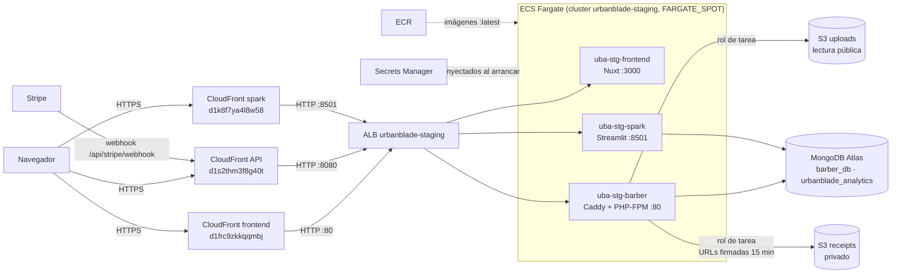

# Despliegue de staging en AWS

Estado al 18 de septiembre de 2026. Entorno de **pruebas** (no producción) que corre
los tres proyectos activos —`barber` (API), `frontend-urban` (Nuxt) y `spark`
(dashboard)— en AWS. Sustituye al plan de Oracle Cloud de
[`ORACLE_CLOUD_PRUEBAS.md`](ORACLE_CLOUD_PRUEBAS.md), que nunca llegó a desplegar la
aplicación.

- Cuenta AWS `209479293733`, región `us-east-1`.
- Sin dominio propio todavía: HTTPS lo da CloudFront con su certificado (`*.cloudfront.net`).
- Credenciales de acceso: no viven aquí. Las de la aplicación están en Secrets Manager
  (nombres abajo, nunca valores); las de las cuentas de prueba, en [`ACCESOS.md`](ACCESOS.md).

## Arquitectura



Los usuarios de Atlas siguen el mínimo privilegio descrito en
[`ADR-001-ARQUITECTURA-DE-DATOS.md`](ADR-001-ARQUITECTURA-DE-DATOS.md).

## Recursos

| Recurso | Nombre / valor |
|---|---|
| Repos ECR | `urbanblade/barber`, `urbanblade/frontend-urban`, `urbanblade/spark` |
| Cluster ECS | `urbanblade-staging` (estrategia por defecto FARGATE_SPOT) |
| Servicios | `uba-stg-barber`, `uba-stg-frontend`, `uba-stg-spark` |
| Task definitions | `urbanblade-staging-barber` (512 CPU / 1 GB), `-frontend` (512 / 1 GB), `-spark` (1024 / 3 GB) |
| Balanceador | ALB `urbanblade-staging`; listeners 80 → frontend, 8080 → barber, 8501 → spark |
| Health checks | frontend `/api/health`, barber `/up`, spark `/_stcore/health` |
| Red | VPC por defecto `vpc-052236dd391444209`, subredes d y f; SG del ALB `sg-0a537dcb25fcf51b2` (:80), `sg-0372b1aa878f1657f` (:8080), `sg-01da9703671ffd6ad` (:8501), todos solo desde CloudFront; SG de tareas (solo desde el ALB) `sg-0d01fa3c3044c3832` |
| CloudFront | 3 distribuciones (PriceClass_100, sin caché, origen HTTP): frontend `E1LFM8ET3R2TF3`, API `E3VPZXBKIE3G5T`, spark `E1WK7UCZ9FYH79` |
| S3 | `urbanblade-staging-uploads-209479293733` (imágenes públicas), `urbanblade-staging-receipts-209479293733` (privado) |
| Roles IAM | `ecsTaskExecutionRole` (ejecución + lectura de secretos), `urbanblade-staging-task-role` (acceso a los dos buckets) |
| Logs | CloudWatch `/ecs/urbanblade-staging/{barber,frontend-urban,spark}` |

### Secretos (Secrets Manager, `urbanblade/staging/...`)

- `barber/`: `APP_KEY`, `MONGODB_URI`, `ANALYTICS_MONGODB_URI`, `STRIPE_KEY`,
  `STRIPE_SECRET`, `STRIPE_WEBHOOK_SECRET`, `GOOGLE_CLIENT_ID`, `GOOGLE_CLIENT_SECRET`,
  `VAPID_PUBLIC_KEY`, `VAPID_PRIVATE_KEY`.
- `spark/`: `MONGO_PASSWORD`, `ANALYTICS_MONGO_PASSWORD`.

Cambiar un secreto no afecta a las tareas en marcha: hay que forzar un nuevo despliegue.

### Variables relevantes de barber (no secretas)

`APP_ENV=production`, `APP_DEBUG=false`, `APP_URL` = URL de CloudFront de la API (si
empieza con `https://` la app fuerza el esquema https: el ALB reescribe
`X-Forwarded-Proto`), `FRONTEND_URL`, `SPARK_URL`, `CORS_ALLOWED_ORIGINS` = URL de
CloudFront del frontend, `SESSION_DRIVER=file`, `CACHE_STORE=file`,
`QUEUE_CONNECTION=sync`, `UPLOADS_BUCKET`, `RECEIPTS_BUCKET`, `AWS_DEFAULT_REGION`.

## Puesta en marcha desde cero

Orden para reconstruir el entorno en una cuenta nueva. Los pasos marcados **(consola)**
los hace una persona con permisos de administrador de IAM; el resto se puede hacer con
el usuario `staging-deploy`.

1. **(consola)** Crear el usuario IAM `staging-deploy` con acceso programático y
   permisos sobre ECR, ECS, ELB, EC2 (grupos de seguridad), Secrets Manager, CloudWatch
   Logs, CloudFront (`CloudFrontFullAccess`) y S3 (`AmazonS3FullAccess`). No necesita
   crear roles ni leer IAM. Configurar `aws configure` con sus claves.
2. **(consola)** Crear los roles: `ecsTaskExecutionRole` (servicio ECS Task, política
   gestionada `AmazonECSTaskExecutionRolePolicy` + `SecretsManagerReadWrite`) y
   `urbanblade-staging-task-role` (servicio ECS Task, política insertada `s3-uploads`
   con `s3:GetObject/PutObject/DeleteObject/ListBucket` sobre los dos buckets).
3. Crear los tres repositorios ECR, construir y subir las imágenes (runbook abajo).
4. Crear los buckets S3: `uploads` con acceso público de lectura solo de objetos
   (`s3:GetObject` en la política del bucket, bloqueo público desactivado solo para
   políticas) y `receipts` con todo el acceso público bloqueado.
5. Crear los secretos en Secrets Manager con los nombres de la sección de secretos
   (los valores salen de los `.env` locales; nunca se imprimen ni se commitean).
6. Crear el cluster ECS, las task definitions (con `taskRoleArn` y `executionRoleArn`),
   los grupos de destino con sus health checks, el ALB con sus tres listeners y los
   servicios Fargate Spot.
7. Crear los grupos de seguridad: uno por puerto del ALB, abiertos solo a la lista de
   prefijos administrada de CloudFront (`com.amazonaws.global.cloudfront.origin-facing`),
   y el de las tareas, que solo acepta tráfico de los del ALB.
8. Crear las tres distribuciones de CloudFront: origen HTTP hacia el ALB en su puerto,
   política de caché *CachingDisabled*, política de origen *AllViewer*, todos los
   métodos HTTP, redirección a https y `readTimeout` de 60 s.
9. Actualizar `APP_URL`, `FRONTEND_URL`, `SPARK_URL`, `CORS_ALLOWED_ORIGINS` y
   `GOOGLE_REDIRECT_URI` de la task definition de barber con las URL de CloudFront
   resultantes, y `NUXT_PUBLIC_API_BASE` en la del frontend; desplegar de nuevo.
10. Configurar los servicios externos: Google en
    [`GOOGLE_CLOUD_OAUTH.md`](GOOGLE_CLOUD_OAUTH.md), la base y sus usuarios en
    [`MONGODB_ATLAS.md`](MONGODB_ATLAS.md) y el webhook de Stripe (sección siguiente).

## Integraciones externas

- **Stripe:** el destino del webhook debe crearse en la **misma cuenta de Stripe** que
  emite las claves `STRIPE_KEY`/`STRIPE_SECRET` (los eventos solo se entregan a
  destinos de la cuenta que procesó el pago). URL: `<CloudFront API>/api/stripe/webhook`
  (no lleva `/api/v1`). Eventos de tipo instantáneo; el `whsec_` del destino va en
  `STRIPE_WEBHOOK_SECRET`. Verificado el 2026-09-18 con un pago real de prueba.
- **Google login:** agregar `<CloudFront API>/api/v1/auth/google/callback` como URI de
  redirección autorizada en Google Cloud Console. Detalle en
  [`GOOGLE_CLOUD_OAUTH.md`](GOOGLE_CLOUD_OAUTH.md).
- **MongoDB Atlas:** usuarios, roles y acceso de red en [`MONGODB_ATLAS.md`](MONGODB_ATLAS.md).

## Runbook

Los comandos usan `aws` con el usuario IAM `staging-deploy`.

**Apagar (ahorra el cómputo; el ALB sigue cobrando):**

```bash
for s in barber frontend spark; do aws ecs update-service --cluster urbanblade-staging --service uba-stg-$s --desired-count 0 --region us-east-1; done
```

**Encender:** el mismo comando con `--desired-count 1`.

**Desplegar una imagen nueva** (ejemplo `barber`; `frontend-urban` y `spark` igual con su repo):

```bash
docker build -f .docker/staging/Dockerfile -t 209479293733.dkr.ecr.us-east-1.amazonaws.com/urbanblade/barber:latest .
aws ecr get-login-password --region us-east-1 | docker login --username AWS --password-stdin 209479293733.dkr.ecr.us-east-1.amazonaws.com
docker push 209479293733.dkr.ecr.us-east-1.amazonaws.com/urbanblade/barber:latest
aws ecs update-service --cluster urbanblade-staging --service uba-stg-barber --force-new-deployment --region us-east-1
```

Antes de subir, comprueba la fecha de creación de la imagen (`docker inspect --format='{{.Created}}'`):
un `docker build` fallido en silencio ya llevó a subir una imagen vieja. Los `push` a ECR
fallan a veces por timeout; reintentar.

**Cambiar variables o secretos:** registrar una task definition nueva
(`aws ecs register-task-definition`) y actualizar el servicio con ella; para secretos
basta `--force-new-deployment`.

**Ver logs:** CloudWatch, grupos `/ecs/urbanblade-staging/*`.

## Costo aproximado

Con los tres servicios encendidos 24/7: ~55–65 USD/mes (Fargate Spot + ALB). Apagados,
queda el ALB (~16–18 USD/mes) más centavos de ECR, S3 y Secrets Manager.

## Limitaciones conocidas

- `QUEUE_CONNECTION=sync`, `SESSION_DRIVER=file`, `CACHE_STORE=file`: no hay Redis ni
  worker ni scheduler. Recordatorios y tareas programadas **no corren** en staging, y
  la sesión/caché se pierden al reiniciar la tarea.
- El ALB solo acepta tráfico de CloudFront (lista de prefijos `pl-3b927c52`), con un
  grupo de seguridad por puerto (`uba-stg-alb-cf-80`, `-8080`, `-8501`) porque la lista
  cuenta como ~55 reglas y el límite es 60 por grupo. Las tareas aceptan tráfico de
  `uba-stg-alb-cf-80`. El acceso directo `http://<ALB>:puerto` ya no responde.
- Fargate Spot puede interrumpir tareas; el servicio las repone solo.
- Sin dominio propio ni certificado ACM; al comprarlo hay que cambiar `APP_URL`,
  `FRONTEND_URL`, CORS, el callback de Google y el destino del webhook de Stripe.
- `staging-deploy` no puede crear roles IAM ni revocar reglas de grupos de seguridad:
  esos pasos se hacen desde la consola.
- Los grupos de seguridad antiguos `sg-02338d6cb80cf5866` y `sg-0dbd32344bd423d23` (con
  reglas abiertas a `0.0.0.0/0`) ya no están asociados al ALB y pueden eliminarse; el
  segundo sigue referenciado por reglas del grupo de las tareas, que hay que quitar
  primero desde la consola.
